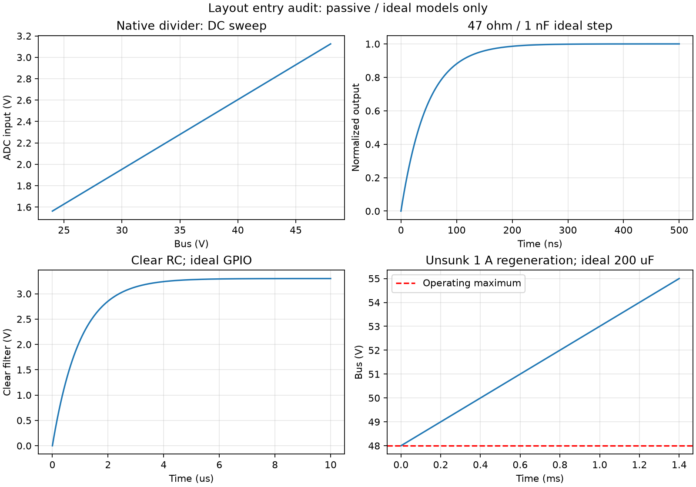

# 原理图说明、电气仿真与 PCB layout 入口审查

后续更新：用户已要求在新分支修复。两项P0与图板一致性问题现已关闭，最新为ERC0/0、parity0、271DRC/478未连接。见[修复记录](layout_entry_repair_2026-10-09.md)。下文保留修复前审查与仿真边界，不代表当前仍有这两项接线缺陷。

本轮结论：**可以继续机械与功能分区预布局；正式器件布局/布线冻结 BLOCKED。** ERC 为零，但发现两项明确的器件应用缺陷。此轮保留硬件源文件，完成独立审查、局部 ngspice 仿真与说明文档，不把发现问题等同于已经修复。

## 本轮设计基准与证据

沿用现有架构与接口文档，用户于2026-10-09确认 **24–48V母线、10A连续相电流、20kHz PWM**。热耗暂按10A RMS计算，仍需确认RMS/峰值定义、环境温度、冷却条件、电机参数、峰值电流及回馈功率/能量。历史15A连续、25A/5s、55V上限、10–40kHz不构成本轮放行指标。48V以上仅用于过压风险计算。

审查基线是分支 `fix/ocp-latch-industrial-review` 的提交 `79dd6fc`，包括工作区已有 `.kicad_pro` 设置变化；不假定该设置与Git提交相同。KiCad10.0.3直接从8页原生层级导出。系统XML：159对象/180网；实际板级网表：157元件/179网（板外F1/J6不进入PCB）。[证据目录](reviews/layout_entry_2026-10-09/)保存鲜网表、原生ERC/DRC、检查日志、源文件哈希和模拟输出。源文件前后哈希一致，PCB仍为 `581f590151e439a771ab280e0449887680f917d3f7b9451c74a67d4b1b849eec`。

| 检查 | 本轮结果 | 含义 |
|---|---|---|
| 六项仓库源检查 | PASS | 原生语法、50mil网格、A4布局、可见连接、电源/GND可见接线、必需设计文件 |
| KiCad ERC | 0错误 / 0警告 / 0排除 | 不检查串行模式专用应用条件或符号端子语义 |
| 板级网表安全检查 | PASS，157/179 | 已有规则覆盖的供电、门控、下拉、采样连接 |
| OCP稳定数字状态 | 531场景 PASS | 不含模拟速度、短脉冲、竞争、功率MOSFET应力 |
| PCB检查工具回归 | 11项 PASS | 校验工具回归，不等于当前板合格 |
| 物理焊盘/网络一致性 | FAIL | PCB多F1、J3.1仍VIN_RAW而非VIN_FUSED |
| PCB约束检查 | PASS | 当前脚本覆盖的机械/网络约束，不替代原生DRC |
| KiCad DRC（重填铜，不保存板） | 271违规：220错误/51警告；466未连接 | 2交叉走线、17短路、113间距、88阻焊桥、8悬空线、43孤立铜 |
| 原生原理图一致性 | 3警告 | J3.1网络冲突、J1缺Board_Revision字段、PCB残留F1 |

DRC仍有五项继承忽略类型：missing_courtyard、track_not_centered_on_via、tuning_profile_track_geometries、footprint_filters_mismatch、footprint_type_mismatch。未新增忽略、降低严重度或删除连接。后续制造放行须复核这些配置。静态XML结构审计包含板外元件，不能代替实际板级网表的原生一致性结论。

## 八页原理图的功能与阅读说明

| 页/文件 | 功能与主要链路 | 布局与验证重点 |
|---|---|---|
| 顶层 ax7010_servo_reva | 七个子页层级端口互联；分开母线、三电源域、PWM、采样、保护、编码器 | 子页电源/GND端口和图形必须通过真实可见导线接元件，不允许旁边孤立图例代替连接 |
| power_input | 板外PSU J6→外部F1→J3 VIN_FUSED→LM74502/Q7/Q8→VBUS_PROT；R1/R2/R3/C5检测母线 | 外置熔断器需协调线缆/故障能量；D1是DNP；没有已合格的制动吸收器 |
| aux_power | LM5164将母线转12V；TPS62163固定5V；PG开漏并联为PWR_GOOD | 输入/开关回路、FB纹波网络、有效电容、磁件饱和和嵌套负载预算 |
| gate_inverter | FD6288三相驱动→六MOSFET→三相shunt→电机J4；自举VB/VS和栅源下拉 | D2..4物理极性P0；预充/刷新/死区；功率与栅极回路、SW铜面与采样隔离 |
| current_adc | 5mΩ Kelvin→INA241A2→47Ω/1nF→ADS8588S及窗口比较器 | U6串行模式接地P0；REF/REGCAP去耦；采样窗口；共用RC改变会同时影响OCP |
| ocp_latch | OCP、PG、双域监督→异步清锁存；EN低时CLEAR边沿重武装；ARMED门控PWM | 总关断时间、CLEAR竞争、欠压窗口、三域部分供电、配置期默认关断 |
| encoder | ABZ差分→TPD6E05U06/AM26LV32E→FPGA；共享5V经F2供编码器 | 端接DNP、屏蔽NC、ESD共模、PTC型号与短路拖垮模拟电源风险 |
| ax7010_interface | J1接已确认2022版J10；PWM/EN/CLEAR、ADC双DOUT、ABZ与诊断；J2 DNP | 实物逐针连续性、XDC/LVCMOS33、VIO预算与电缆回流；不能将J2当已实现并行ADC接口 |

VDRV_12V由母线产生，VA_5V来自12V级；VIO_3V3由AX7010提供。所有域共GND，但PCB回流不能任意混用。门驱/桥臂脉冲不得经过ADC参考或Kelvin支路。电源符号表达网络名称，局部真实接线与电容回路仍须在图面直接可读。接口细节沿用 [AX7010接口](ax7010_interface.md)，保护协议沿用 [OCP锁存说明](ocp_latch_review_2026-10-09.md)。

## 必须先关闭的明确问题

1. **P0：D2..D4极性编号冲突。** 自定义符号A1/K2，而指定官方D_SMA为K1/A2。图上12V→阳极、阴极→BST的方向正确，但按当前封装阴极带装配会反接。应统一真实端子与符号/封装编号，逐个确认实物阴极、焊盘、网表及装配图；不能靠旋转图形掩盖。D1/D_SMC有同类潜伏缺陷，目前DNP。详见 [功率级审查](power_stage_layout_review_2026-10-09.md)。
2. **P0：U6串行模式13脚错误NC。** 物理pins16..22、27..32（DB0..6、DB9..13、DB14/HBEN）按TI要求应接DGND/低电平。现有输出型引脚和NC标记使ERC无法发现。修复后须新增逐物理脚回归并重新导出/ERC。详见 [模拟与安全审查](analog_safety_layout_review_2026-10-09.md)。

这些结论来自物理端点与厂家应用条件比较，未通过降低ERC/DRC严重度消除。零ERC不能作为关闭证据。

## 已完成的局部电气仿真

本机KiCad附带 **ngspice-46 shared library**。工具先读取鲜XML的元件值并校验端点拓扑，再生成六份SPICE电路；DC/瞬态实际由ngspice求解。采用明确数值精度选项，结果与独立闭式计算交叉检查PASS。模拟方法参考 [ngspice官方共享库接口](https://ngspice.sourceforge.io/shared.html)。启动有找不到spinit提示，当前理想R/C源仿真不需要该文件；本轮未加载厂商IC模型。库哈希、日志、网表哈希在results.json中。

| 模型/工况 | 数值结果 | 解释及边界 |
|---|---|---|
| 母线分压DC，24..48V，1V步进 | ADC输入1.562604..3.125209V | 名义R值；未含漏电、ADC加载、温漂 |
| 分压戴维南等效RC，1V阶跃 | τ364.608us，fc436.51Hz | 归一化等效输出阶跃；不是输入母线过压保护仿真 |
| OCP分压DC，VA5=4.75..5.25V | 5V时低/高限0.294118/4.705882V，标称±22.0588A | 电流换算采用名义INA增益20和5mΩ；不是比较器/INA瞬态模型 |
| 静态角点枚举 | 20.743..23.402A | VA5±5%、分压±0.1%、shunt±1%；不含IC误差/温度/延迟，5%是探索工况不是批准电源公差 |
| R40/C40，理想1V阶跃 | τ47ns，fc3.386MHz；20kHz增益−0.0001515dB | 基本不衰减PWM基频；不能据此称抗混叠/电流保护合格 |
| R88/C92，理想3.3V GPIO阶跃 | τ1us | R87负载接理想源侧；没有GPIO输出阻抗、逻辑阈值或竞争模型 |
| C1+C2=200uF，48V初值，无吸收，注入1A | 1.4ms到55V，额外储能0.0721J | 无源钳位/ESR/ESL；55V为过压演示，不能作允许母线值 |



仿真工具与输出：[脚本](../tools/simulate_layout_entry.py)、[结果JSON](reviews/layout_entry_2026-10-09/simulation/results.json)、[电路/CSV/日志](reviews/layout_entry_2026-10-09/simulation/)。复现示例（先从当前原理图重新导出，不复用过期网表）：

```powershell
kicad-cli sch export netlist --format kicadxml --output artifacts/layout_netlist.xml hardware/ax7010_servo_reva.kicad_sch
python tools/simulate_layout_entry.py artifacts/layout_netlist.xml --ngspice-library D:/Software/KiCad/10.0/bin/ngspice.dll --output artifacts/layout_simulation
```

独立审查已重跑同一工具，数值结果一致；另用网表副本移除R40.2，验证脚本在加载模拟器前拒绝错误拓扑（[拒绝测试](reviews/layout_entry_2026-10-09/simulation_guard_test.json)）。文档本地链接、证据哈希及图像布局已检查。

这些结果只关闭“名义被动网络计算有可重复证据”这一项。没有电机/负载/源模型、厂商MOSFET/驱动/INA/ADC/比较器模型或PCB寄生，因此没有完整三相逆变器、电源启动环路、总OCP速度、死区直通、ADC建立时间、热或EMC仿真合格结论。

## 正式布局的关闭顺序与交付要求

| 阶段 | 要求 | 当前状态 |
|---|---|---|
| 原理图修复 | 两项P0和D1潜伏问题；补机器可查回归，BOM/图纸/网表统一 | OPEN |
| 电气规格冻结 | RMS/峰值、环境、冷却、源吸收与回馈能量；OCP阈值与软件限流 | OPEN；10A连续已确认 |
| 元件/供电资格 | 完整MPN、封装方向、C有效容量、L饱和、DC-link纹波、F2、VIO预算、ADC欠压策略 | OPEN；LM5164主要元件已与TI参考拓扑核对 |
| 受控预布局 | 保留130×95mm轮廓及H1..4中心；功能分区、连接器/散热空间、测点规划 | 可继续；不代表电气布局冻结 |
| PCB同步 | 备份板，关闭电气/封装缺陷，再移除板外F1、改J3网络、协调J1字段；核查物理焊盘/UUID/DNP | OPEN；当前parity FAIL |
| 关键布局/布线 | 先DC-link/半桥/栅回路，再Kelvin/ADC参考/OCP，再数字与编码器；叠层铜厚和热模型确定线宽/过孔 | OPEN；禁止以当前20条旧线为可用成品 |
| 低能量验证 | 电源独立启停、所有VGS/死区、bootstrap、短路/OCP、CLEAR竞争、编码器负载、采样共模恢复 | OPEN；先限能，不直接24/48V满电流 |
| 冻结/制造 | 最新ERC/DRC/parity、0未连接、已审包封/装配方向、10A热浸/切换过冲、全部release gates | BLOCKED |

建议在板上预留VDRV、VA5、VIO、POR_N、PWR_GOOD、OCP_N、ARMED、RUN_OK、CLEAR_FILT、三路电流输出、VBUS_ADC及六路栅源测量位置。高侧VGS/自举使用合格差分测量方式；测点与探头空间不能扩大高di/dt环路。

总关断预算必须覆盖INA→共用RC→比较器/开漏→锁存/门控→FD6288→MOSFET栅放电，不能只引用32ns数字链。TPS3808G50最坏下降阈值可能低于ADC的4.75V最小供电；PWR_READY不等于ADC有效。三域独立存在/消失、FPGA配置/高阻和残压需验证。其余逐项证据与厂商链接见两份专项审查，统一关闭清单仍在 [release_gates.md](release_gates.md)，上电步骤仍在 [bringup.md](bringup.md)。
